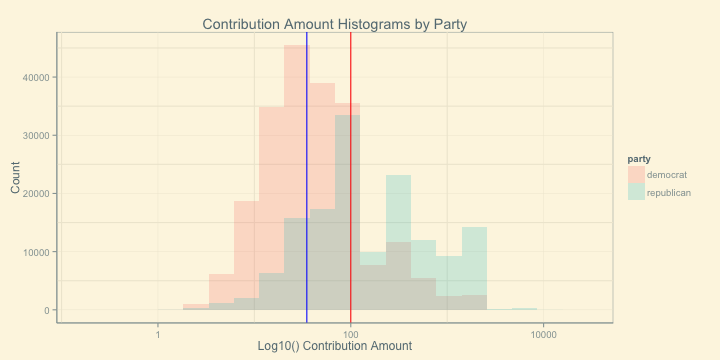

A Look at Election Campaign Contributions with R
========================================================


The state of Florida, every four years, is a definitive swing state in the US Presidential election. Since 1996 -- 5 election cycles ago -- the candidate that captured Florida's electoral votes became the next US President. Noting a strong correlation between campaign spending and election results (as well as the notion of you need to raise money to sepdn money) and having perfect hindsight of knowing how the 2012 Presidential election results, analyzing campaign contributions data can help us put the answers to a lot of questions (below) into context.

In Florida, which candidates received the most dollars and from how many people? Which is a better indicator for race position? Where do contributors reside? What do they do? When do they donate? Are there distinct characteristics in the data between Republican contributors, Democratic contributors.. and other party contributors? If so, given these characteristics, can we predict which political party an individual/entity will contribute to? Is the total campaign donation as important as count of contributors and/or amount per contributor? And so on...

I conducted this analysis as part of Udacity's Data Analysis with R and my full code can be found here. The remainder of this post is an overview of the most interesting findings.

# Data Overview

Data source here. Roughly 361K contributions starting 1.8 years prior to election date and processing payments up to a month after. 14 total candidate (1 Democrat). 1,468 zip codes after some minor cleaning and around 12,600 unique occupations telling us that the occupation data is a disaster [US BLS tracks 800 jobs across the US](http://www.bls.gov/bls/occupation.htm). Most frequent contribution amount is $100. Now let's go a bit deeper...

# 1. Contribution #  >  Contribution $

While total Republican contribution dollars trumped those of Democrats by a factor of nearly 3 ($65M to Repubs and $23M to Dems), total # of Democrat contributions outpaced the Republican count 1.5x (210K to 145K). This tells me there was broad Democrat support in FL in 2012. Plotting the cumulative contribution dollars over the course of the campaign cycle shows Mitt Romney as the powerhouse player.


```
## Source: local data frame [3 x 3]
## 
##               party        amt  count
##               (chr)      (dbl)  (int)
## 1          democrat 23228483.7 210519
## 2 libertarian/other   140767.1    560
## 3        republican 64890142.8 145605
```

 

But, if we do the same thing for cumulative count the front runner of the race and eventual President elect pulls ahead.

 

No matter how much money an individual has, when they enter the ballot booth their vote is just as important as the next person. The importance of broad support is clear in this case. When FEC contribution data is released in Novermber 2015, maybe we will see a similar patter emerge in the state of Florida.

# 2. Contribution Size Matters

If Republicans raised more total dollars with fewer contributions than Democrats, it must be true that the average Republican contribution was larger. The median Republican contribution was $100 vs. Demorcrats $35. That's a statistically significant difference using the wilcox.test in r! Practically significant in real life too :) An overlay histogram displays this nicely with a blue line representing the Democrat median and a red line representing Republican median.

 
