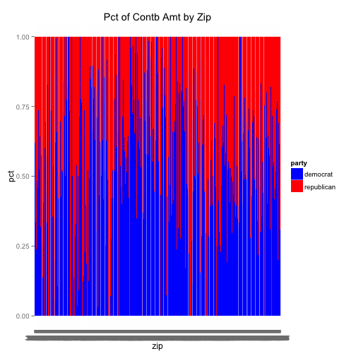
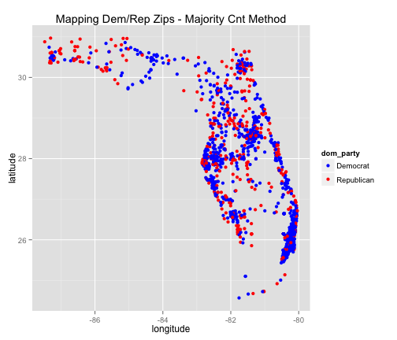

"2012 Florida Campaign Donation Analysis"

========================================================

# Introduction

This is an exploration of 2012 US presidential campaign donations in the state of Florida. Over the past few decades, Florida has been the most populated of the "swing states" -- states where both political parties (republican/democrat) have a similar level of support. The dataset comes from the [Federal Election Committee](http://www.fec.gov/disclosurep/PDownload.do). [In 1975, the US Congress created the Federal Election Commission (FEC) to administer and enforce the Federal Election Campaign Act (FECA) - the statute that governs the financing of federal elections... and oversees the public funding of Presidential elections.](http://www.fec.gov/about.shtml). Noting a strong correlation between [campaign spending and election results](http://www.thewire.com/politics/2013/11/does-more-campaign-money-actually-buy-more-votes-investigation/71473/) and having perfect hindsight of knowing how the 2012 Presidential election results, analyzing this dataset can put the answers to a lot of questions (below) into context.

In Florida, which candidates received the most dollars and from how many people? Where do these contributors reside? What do they do? When do they donate? Are there distinct characteristics in the data between Republican contributors, Democratic contributors.. and other party contributors? If so, given these characteristics, can we predict which political party an individual/entity will contribute to? Is the total campaign donation as important as count of contributors and/or amount per contributor? Do more people contribute on weekdays or weekends ([this gets hairy since donation day not necessarily equal to donation processed day](http://www.mattblackwell.org/files/papers/gamechangers.pdf))? Is contribution size (large vs. small) on a given day important? If so, can we predict contribution amount on a particular day of the campaign?

Lots of questions, lets look for some answers...


```r
# Setting up the data and loading our 'crucial' tools
setwd("/Users/frankCorrigan/Downloads")

# Libraries used for... everything
library(dplyr)
```

```
## 
## Attaching package: 'dplyr'
## 
## The following objects are masked from 'package:stats':
## 
##     filter, lag
## 
## The following objects are masked from 'package:base':
## 
##     intersect, setdiff, setequal, union
```

```r
library(ggplot2)
library(ggthemes)
library(gridExtra)

# Row names read in a bit fucked up, so little adjustment needed
data <- read.csv("FEC_FL2012_Data.csv", row.names = NULL)
correct_names <- names(data)[2:length(names(data))]
data <- select(data, -election_tp)
names(data) <- correct_names
```

# Univariate Analysis


```r
str(data)
```

```
## 'data.frame':	361634 obs. of  18 variables:
##  $ cmte_id          : chr  "C00495820" "C00495820" "C00495820" "C00495820" ...
##  $ cand_id          : Factor w/ 14 levels "P00003608","P20002523",..: 12 12 12 12 12 13 13 13 13 13 ...
##  $ cand_nm          : Factor w/ 14 levels "Bachmann, Michele",..: 8 8 8 8 8 7 7 7 7 7 ...
##  $ contbr_nm        : Factor w/ 82175 levels "& KOHN, P.A., GOUDIE",..: 9674 17733 65674 41698 67784 49678 37315 55553 15785 55269 ...
##  $ contbr_city      : Factor w/ 1396 levels "_MIAMI","???????? MIAMI",..: 187 722 426 724 431 722 500 341 921 1281 ...
##  $ contbr_st        : Factor w/ 1 level "FL": 1 1 1 1 1 1 1 1 1 1 ...
##  $ contbr_zip       : Factor w/ 51231 levels "","00000","00023",..: 15203 23557 8847 21273 36514 19684 15411 39700 2907 34831 ...
##  $ contbr_employer  : Factor w/ 28948 levels "","---","(SELF) DIGITAL SOLUTIONS  INTEGRATION",..: 27976 22790 18168 14109 22705 21281 18315 14446 4736 21281 ...
##  $ contbr_occupation: Factor w/ 12643 levels ""," CAPITAL",..: 1592 12569 9610 201 8074 9610 9610 9571 1294 9610 ...
##  $ contb_receipt_amt: num  20 100 50 50 500 100 10 50 100 25 ...
##  $ contb_receipt_dt : Factor w/ 653 levels "01-APR-12","01-AUG-11",..: 110 110 110 110 110 494 242 297 618 491 ...
##  $ receipt_desc     : Factor w/ 26 levels "","ATTRIBUTION TO PARTNERS REQUESTED / REDESIGNATION REQUESTED",..: 1 1 1 1 1 1 1 1 1 1 ...
##  $ memo_cd          : Factor w/ 2 levels "","X": 1 1 1 1 1 1 1 1 1 1 ...
##  $ memo_text        : Factor w/ 199 levels "","*","* EARMARKED CONTRIBUTION: SEE BELOW",..: 1 1 1 1 1 1 1 1 1 1 ...
##  $ form_tp          : Factor w/ 3 levels "SA17A","SA18",..: 1 1 1 1 1 1 1 1 1 1 ...
##  $ file_num         : int  779227 779227 779227 779227 779227 756218 756218 756218 756218 756218 ...
##  $ tran_id          : Factor w/ 306729 levels "0000026","0000140",..: 6312 6313 6314 6315 6316 15636 14567 16416 17275 16768 ...
##  $ election_tp      : Factor w/ 7 levels "","G2008","G2012",..: 7 7 7 7 7 7 7 7 7 7 ...
```

Initial observations. 361K donations, 19 features -- mostly categorical, one numeric, one date (that's still factor and we'll convert to date object almost immediately). There is no party affiliation perse -- will need to add that. There is a lot of inconsistency in contributor city name and zip which will have to be cleaned to do any mapping. For instance, ST. AU7GUSTINE, ST. AUGUSTINE, ST. AUGUTINE, ST, AUGUSTINE. There will be a lot of missing/invalid values in contrb employer and occupation.


```r
data$date <- as.Date(data$contb_receipt_dt, format = "%d-%b-%y")
nom_date <- as.Date("28-AUG-12", format = "%d-%b-%y")
elec_date <- as.Date("06-NOV-12", format = "%d-%b-%y")
data$days_from_elec <- as.integer(elec_date - data$date)
summary(data$date)
```

```
##         Min.      1st Qu.       Median         Mean      3rd Qu. 
## "2011-01-12" "2012-06-29" "2012-09-16" "2012-07-30" "2012-10-17" 
##         Max. 
## "2012-12-31"
```

```r
summary(data$days_from_elec)
```

```
##    Min. 1st Qu.  Median    Mean 3rd Qu.    Max. 
##  -55.00   20.00   51.00   98.43  130.00  664.00
```

Immediately, we make the date usable and see that campaign contributions start 664 days! before the election even takes place and are processed up to 45 days after.


```r
table(data$cand_nm) # 14 unique -- Stein = 45 & McCotter = 1 -- remove these
```

```
## 
##              Bachmann, Michele                   Cain, Herman 
##                            699                           1720 
##                 Gingrich, Newt                  Huntsman, Jon 
##                           5041                            337 
##             Johnson, Gary Earl           McCotter, Thaddeus G 
##                            272                              1 
##                  Obama, Barack                      Paul, Ron 
##                         213335                           9123 
##              Pawlenty, Timothy                    Perry, Rick 
##                            258                            632 
## Roemer, Charles E. 'Buddy' III                   Romney, Mitt 
##                            305                         127251 
##                 Santorum, Rick                    Stein, Jill 
##                           2615                             45
```

```r
data <- subset(data, cand_nm != "Stein, Jill" & cand_nm != "McCotter, Thaddeus G") # Removes 46 observations
ggplot(aes(x=cand_nm), data=data) +
      geom_bar() +
      ggtitle("Count of Contributions by Candidate") +
      coord_flip() # Barak most contributions by far, followed by romney, followed by Ron Paul
```

 

```r
ggplot(aes(x=cand_nm), data=subset(data, date < nom_date)) + # Even playing field using only days before Romney nominated Repub candidate
      geom_bar() +
      ggtitle("Count of Contributions Pre-Nomination Date by Candidate") +
      coord_flip() # Not a huge difference. Romney and Barack still way out front
```

 

There were 14 candidates in the race, but at least 2 with minimal donations in FL can be removed -- Jill Stein and Thaddeus McCotter. First, we see how many contributions each candidate got during the total election cycle, and then filter it down to look at only days before Mitt Romney was nominated the Republican candidate which was August 28, 2012. Barak Obama wide leader in both instances. Maybe this is only because he is the incumbent and only Democratic candidate. What changes if we look at number of contributions per day in the race?


```r
contrib_per_day_in_race <- data %>%
                           group_by(cand_nm) %>%
                           summarize(min = min(date), max = max(date), n=n()) %>%
                           mutate(days = max-min, contrib_per_day = n/as.numeric(days)) # Herman Cain in race for 670 days (most).. Michele Bachmann in race for 219 days (least)
ggplot(aes(x=cand_nm, y=contrib_per_day), data=contrib_per_day_in_race) +
      geom_bar(stat="identity") +
      coord_flip()
```

 

Not much at all. Mr. Obama still wide leader. So, let's group the by politcal party to better understand the contribution distribution.


```r
data$party <- ifelse(data$cand_nm == "Obama, Barack", c("democrat"), c("republican")) 
data$party[data$cand_nm == "Johnson, Gary Earl"] <- "libertarian"
data$party[data$cand_nm == "Roemer, Charles E. 'Buddy' III" | data$cand_nm == "Stein, Jill"] <- "other"
table(data$party)
```

```
## 
##    democrat libertarian       other  republican 
##      213335         272         305      147676
```

Wow. Democrats has almost 1.5x as many donations as Republicans in FL in 2012. As background, Florida's electoral votes went Democrat in 2008 as well as 1996... but went Republican in 2000 and 2004. Moving on to contributor data.

For starters, how many contributions did the average individual/entity make and how many unique locations were contributors in?


```r
mean(table(data$contbr_nm)) # Average # of contributions is 4.4 assuming each name is unique. Wish there was a contributor id... quick search says multiple contributions from single contributor
```

```
## [1] 4.400219
```

```r
length(table(data$contbr_city)) # Lots of variety in single city names... not sure it's worth fixing
```

```
## [1] 1396
```

```r
length(table(data$contbr_zip))
```

```
## [1] 51231
```

This shows us average number of contributions was 4 (assuming different people aren't using the same name), there was 1,400 unique city names, and 51,000 unique zip codes. Let's dive in and clean up those zip codes using the [zipcode](https://cran.r-project.org/web/packages/zipcode/zipcode.pdf) package.


```r
library(zipcode) # https://cran.r-project.org/web/packages/zipcode/
data$zip = clean.zipcodes(data$contbr_zip) # Leaves us with many 9-digit zips. Shorten to 5-digit zips.
data$zip = substr(data$zip, 1, 5)
length(table(data$zip))
```

```
## [1] 1468
```

The clean zipcodes function still leaves us with many 9-digit zipcodes. For those we use the first 5 digits. This gives us a more manageable 1,468 zip codes. But we are not done, some of these zip codes are not even in Florida. So we remove those too and at the same time add latitude and longitude coordinates to our data based on these remaining zip codes.


```r
data <- subset(data, zip >= 30000 & zip < 40000) # We lose 423 observations
# Now, are all of our zip codes in FL?
data(zipcode)
data <- left_join(data, zipcode, by="zip")
# TODO -- check contb_city with zipcode city
data <- filter(data, state == "FL")
```

Regarding contributor's occupations. What is the mode of contributor occupation? How many unique occupations are in this dataset?


```r
tail(sort(table(data$contbr_employer)),1) 
```

```
## RETIRED 
##   98389
```

```r
length(sort(table(data$contbr_occupation)))
```

```
## [1] 12643
```

I won't worry about the inconsistency in occupation for now (RETIRED, RETIRED TEACHER, HAPPILY RETIRED, ETC.), but just note that it exists.

Contribution amount analysis will start with a summary.


```r
summary(data$contb_receipt_amt)
```

```
##     Min.  1st Qu.   Median     Mean  3rd Qu.     Max. 
## -25000.0     25.0     52.0    234.2    200.0  25000.0
```

So 25,000's looks like either an error or maybe interparty transfer. Either way, I'm not going to view it as an outlier and drop it for now. At the same time, I am going to leave negative values out -- this is money either returned to contributor or transfered to another affiliation.


```r
data <- subset(data, contb_receipt_amt < 25000 & contb_receipt_amt > -25000)
data <- subset(data, contb_receipt_amt > 0)
```

The overall distribution of amount is very right skewed -- lots of small donations and some quite large one. I include a red line as an indication of the individual contribution limit.


```r
qplot(contb_receipt_amt, data = data, geom = "histogram") +
      geom_vline(xintercept=2700, color="red")
```

```
## stat_bin: binwidth defaulted to range/30. Use 'binwidth = x' to adjust this.
```

 

And if we do a binwidth of 1...


```r
qplot(contb_receipt_amt, data = data, geom = "histogram", binwidth = 1, color = "red") +
      geom_vline(xintercept=2700, color="blue") 
```

 

And what are the most common contribution amounts?


```r
tail(sort(table(data$contb_receipt_amt)), 20)
```

```
## 
##    30    75     5   150    55    56    20   200    14    19  1000    15 
##  2928  3057  4144  4288  4330  4890  5892  8559  8996 10082 10363 12453 
##  2500   500    10    35    25   250    50   100 
## 14067 16281 16338 26279 29156 29554 39612 59656
```

100 is the mode... followed by 50, 250, and 25. All comfortable #'s. And when do these contributions happen -- a year before the election or the day before? Or somewhere inbetween? The vertical lines on the graph below represent the election day (black) and the day Mitt Romney became Republican nominee (blue).


```r
qplot(date, data = data, geom = "histogram", binwidth = 1, color = "red") + 
      geom_vline(xintercept = as.numeric(nom_date), color = "blue", linetype = 'longdash') +
      geom_vline(xintercept = as.numeric(elec_date), color = "black", linetype = 'longdash') 
```

 

What was learned during the univariate analysis? This dataset has 361K observations with candiadte & contributor features. Barack Obama and Mitt Romney received the most contributions, and Barack Obama had 1.5x the number of contributions than the republicans. The dates have a wide range -- from 664 days before election day to almost a month after. Retired folks are the top contributors (makes sense in Florida). Most contributions are 'small' and most (≈62%) contributions happen within 2 month of election day.


# Multivariate Analysis

Now the fun begins. Earlier, we saw that Barack Obama and Mitt Romney received the most contributions. Is that same for amount of money raised? We start with boxplots for contribution amounts for each candidate and party.


```r
qplot(cand_nm, contb_receipt_amt, data = data, geom = "boxplot") + coord_flip()
```

 

```r
qplot(party, contb_receipt_amt, data = data, geom = "boxplot") + coord_flip() 
```

 

Lots of different patterns between candidates. Tim Pawlenty and Rick Perry have higher medians while Barack Obama might just have the lowest. Also evident that Mitt Romney has some very wealthy contributors. Who raised the most money in this election...


```r
group_by(data, cand_nm) %>% summarize(money = sum(contb_receipt_amt))
```

```
## Source: local data frame [12 x 2]
## 
##                           cand_nm       money
##                            (fctr)       (dbl)
## 1               Bachmann, Michele   194248.00
## 2                    Cain, Herman   690747.82
## 3                  Gingrich, Newt  1782258.49
## 4                   Huntsman, Jon   290224.19
## 5              Johnson, Gary Earl   123480.72
## 6                   Obama, Barack 23228483.74
## 7                       Paul, Ron  1364622.21
## 8               Pawlenty, Timothy   361078.92
## 9                     Perry, Rick   882626.89
## 10 Roemer, Charles E. 'Buddy' III    17286.35
## 11                   Romney, Mitt 58707269.69
## 12                 Santorum, Rick   617066.62
```

Oh right, Romney. When we look at the parties boxplot, again, we see that Republicans received larger donations than Democrats (in this case that's just Barack Obama). Lets look at this information in a table.


```r
filter(data, date > nom_date) %>%
      group_by(party) %>%
      summarize(total = sum(contb_receipt_amt),
                mean = mean(contb_receipt_amt),
                median = median(contb_receipt_amt),
                std = sd(contb_receipt_amt))
```

```
## Source: local data frame [3 x 5]
## 
##         party    total      mean median      std
##         (chr)    (dbl)     (dbl)  (dbl)    (dbl)
## 1    democrat 10506358  80.92085     35 192.5336
## 2 libertarian    43260 569.21053    250 915.4107
## 3  republican 30090507 345.68513    100 634.5738
```

Amazing. Whereas Democrats had more contributions, we see hear that Republicans raised many more dollars. Having perfect hindsight of the 2012 election, this tells me that it's not necessarily about size of contributions but about the number of donations. Next time I see a headline saying "Candidate X raised $4,000,000" I'll know that relatively unimportant :)

Knowing Barack Obama received many small donations.. I am going to delineate small from large at $200 and store that as a feature in the dataset. Also, how does that breakdown look between parties?


```r
data$over200 <- ifelse(data$contb_receipt_amt > 200, "Large", "Small")
prop.table(table(data$party, data$over200))
```

```
##              
##                      Large        Small
##   democrat    0.0631539402 0.5270575636
##   libertarian 0.0004934340 0.0002298954
##   other       0.0000000000 0.0008466878
##   republican  0.1693684045 0.2388500746
```

Since this idea of small/large donations is fascinating to me, I want to do one more thing -- look at the distribution of 


```r
qplot(contb_receipt_amt, data = data, geom = "histogram", binwidth = 25, color = "red") +
      facet_wrap(~party) +
      scale_y_log10()
```

```
## Warning: Stacking not well defined when ymin != 0
```

```
## Warning: Stacking not well defined when ymin != 0
```

```
## Warning: Stacking not well defined when ymin != 0
```

```
## Warning: Stacking not well defined when ymin != 0
```

 

Despite the in contribution size, if we scale the data using ggplots scale_y_log10() function we see that the Democrats and Republicans actually had similar contribution patterns.

We know Mitt Romney raised the most money out of the Republican candidates.. but was that always true. Let's dig deeper


```r
p1 <- ggplot(aes(x = date, y = total, color = cand_nm), 
      data = pre_nom) +
      scale_y_log10() +
      ggtitle("Sum of Contributions") +
      geom_jitter(alpha=1/10) + 
      geom_smooth(method="loess") # noisy
```

```
## Error in ggplot(aes(x = date, y = total, color = cand_nm), data = pre_nom): object 'pre_nom' not found
```

```r
# Count of Monetary Contributions for 'Real' cadidates before Romney's nomination date
p2 <- ggplot(aes(x = date, y = n, color = cand_nm), 
      data = pre_nom) +
      scale_y_log10() +
      ggtitle("# of Contributions") +
      geom_jitter(alpha=1/10) + 
      geom_smooth(method="loess") # still noisy
```

```
## Error in ggplot(aes(x = date, y = n, color = cand_nm), data = pre_nom): object 'pre_nom' not found
```

```r
grid.arrange(p1, p2)
```

```
## Error in arrangeGrob(...): object 'p1' not found
```

Above, I narrowed it down to 'real contenders' and graphed both sum of contributions per day and # of contributions per day between January 2011 and the 2012 election. This graph captures the essence of calling the election a race... on the top Mitt Romney wins and on the bottom Barack Obama wins. This reinforces my notion that it's the # of contributions that really counts. Another way to look at this, maybe, is via cumulative contributions.


```r
pre_elec <- filter(data, date < elec_date, cand_nm %in% for_real) %>%
      group_by(cand_nm, date) %>%
      summarize(n = n(), total = sum(contb_receipt_amt)) %>%
      mutate(cumn = cumsum(n), cumtotal = cumsum(total))
```

```
## Error in eval(expr, envir, enclos): object 'for_real' not found
```

```r
# Sum of Monetary Contributions for 'Real' cadidates before Romney's nomination date
p1 <- ggplot(aes(x = date, y = cumtotal, color = cand_nm), 
      data = pre_elec) +
      scale_y_log10() +
      ggtitle("Cumsum of Contributions") +
      geom_jitter(alpha=1/10) + 
      geom_smooth(method="loess")
```

```
## Error in ggplot(aes(x = date, y = cumtotal, color = cand_nm), data = pre_elec): object 'pre_elec' not found
```

```r
# Count of Monetary Contributions for 'Real' cadidates before Romney's nomination date
p2 <- ggplot(aes(x = date, y = cumn, color = cand_nm), 
      data = pre_elec) +
      scale_y_log10() +
      ggtitle("Cum # of Contributions") +
      geom_jitter(alpha=1/10) + 
      geom_smooth(method="loess")
```

```
## Error in ggplot(aes(x = date, y = cumn, color = cand_nm), data = pre_elec): object 'pre_elec' not found
```

```r
grid.arrange(p1, p2) # Yes! Now this looks like race data to me!
```

```
## Error in arrangeGrob(...): object 'p1' not found
```

That's beautiful. That's race data. However, based on this I would have to say that once a candidate drops out of the race.. for instance Ron Paul.. it doesn't appear that his contributors support (at least monetarily) the frontrunner -- in this case Romnemy. Interesting, indeed, but perhaps not important.

Locations. Where are contributors and can we identify clusters of contributors to a specific political party? All I need is a simple normalized bar chart showing the split between parties across zip codes.


```r
# Is there a clear difference among zip codes where donations are going?
by_zip <- filter(data, party %in% c("democrat", "republican")) %>%
      group_by(zip, party) %>%
      summarize(n = n(), total = sum(contb_receipt_amt)) %>%
      mutate(pct = n/sum(n))

ggplot(by_zip, aes(x=zip, y=pct, fill=party)) +
      geom_bar(stat='identity') +
      scale_fill_manual(values=c("blue", "red"))
```

 

Lots of variation from zip to zip. Variation is good for modeling, but as humans we need a map to get a sense of where these clusters live. 


```r
formap <- left_join(by_zip, zipcode, by='zip') # Ahh, let's drop these GA and other values

formap_dem <- subset(formap, party == "democrat")

formap_dem$dom_party <- ifelse(formap_dem$pct > 0.5, c("Democrat"), c("Republican")) # So if more people contributed to Democrat in this zip... it becomes a democrat zip

ggplot(aes(x=longitude, y=latitude, colour=dom_party), data=formap_dem) +
      geom_point() +
      scale_color_manual(values=c("blue", "red"))
```

 

```r
# Yes, makes sense... contributions to democrats (blue / Obama) dominate the map
```

Lots of blue (Democrat) in Miami, Tampa, and to a lesser extent Orlando and then red (Republican) spread out across the state. This makes sense.

Occupations. By making another normalized bar chart like the one above for zipcode, we see similar variation within and between job fields. 


```r
by_occ <- filter(data, party %in% c("democrat", "republican")) %>%
      group_by(contbr_occupation, party) %>%
      summarize(n = n(), total = sum(contb_receipt_amt)) %>%
      mutate(pct = n/sum(n))

ggplot(by_occ, aes(x=contbr_occupation, y=pct, fill=party)) +
      geom_bar(stat='identity') +
      scale_fill_manual(values=c("blue", "red"))
```

```
## Warning: position_stack requires constant width: output may be incorrect
```

 

I was hoping to seperate 'young' versus 'old' using the occupation data grouping RETIRED into old and everyone else into young, however, the data comes out to be roughly 65/35 where I thought it would be heavier weighted toward 'old'. This does make sense though when you realize that only 15% of the US population is over the age of 65... so 35% is relatively high.


```r
data$retired <- ifelse(data$contbr_occupation == "RETIRED", "YES", "NO")
test <- table(data$retired, data$party)
prop.table(test, 2)
```

```
##      
##        democrat libertarian     other republican
##   NO  0.7061073   0.6317829 0.6490066  0.6866559
##   YES 0.2938927   0.3682171 0.3509934  0.3133441
```

And just a few more things before we start to model this. In total, we saw a lot of contributions coming in 2 months within the election, but what if we break this down by candidate?


```r
don_by_date <- subset(data, contb_receipt_amt > 0 & contb_receipt_amt < 15000) %>%
      group_by(cand_nm, date) %>%
      summarize(donation = median(contb_receipt_amt))

ggplot(aes(x=date, y=donation), # Donation size got smaller as time went on..
      data = don_by_date) +
      geom_line() +
      geom_vline(xintercept = as.numeric(nom_date), color = "red", linetype = 'longdash') +
      facet_wrap(~cand_nm) +
      scale_y_log10() +
      geom_smooth()
```

```
## geom_smooth: method="auto" and size of largest group is <1000, so using loess. Use 'method = x' to change the smoothing method.
## geom_smooth: method="auto" and size of largest group is <1000, so using loess. Use 'method = x' to change the smoothing method.
## geom_smooth: method="auto" and size of largest group is <1000, so using loess. Use 'method = x' to change the smoothing method.
## geom_smooth: method="auto" and size of largest group is <1000, so using loess. Use 'method = x' to change the smoothing method.
## geom_smooth: method="auto" and size of largest group is <1000, so using loess. Use 'method = x' to change the smoothing method.
## geom_smooth: method="auto" and size of largest group is <1000, so using loess. Use 'method = x' to change the smoothing method.
## geom_smooth: method="auto" and size of largest group is <1000, so using loess. Use 'method = x' to change the smoothing method.
## geom_smooth: method="auto" and size of largest group is <1000, so using loess. Use 'method = x' to change the smoothing method.
## geom_smooth: method="auto" and size of largest group is <1000, so using loess. Use 'method = x' to change the smoothing method.
## geom_smooth: method="auto" and size of largest group is <1000, so using loess. Use 'method = x' to change the smoothing method.
## geom_smooth: method="auto" and size of largest group is <1000, so using loess. Use 'method = x' to change the smoothing method.
## geom_smooth: method="auto" and size of largest group is <1000, so using loess. Use 'method = x' to change the smoothing method.
```

 

In the graph above, we graph median donation amount over time. The red line indicates Romney's nomination date. We can see who left the race early (Bachmann, Cain, Perry). We can also see that Romney support really jumped up after his nomination as Republican nominee. To confirm the notion that number of contributions is more important than sum of them, lets look at the same graph as above but by contribution count over time.


```r
don_by_date <- filter(data, contb_receipt_amt > 0 & contb_receipt_amt < 15000 & date < elec_date) %>%
      group_by(cand_nm, date) %>%
      summarize(donation = n())

ggplot(aes(x=date, y=donation),
      data = don_by_date) +
      geom_jitter(alpha = 1/20) +
      geom_vline(xintercept = as.numeric(nom_date), color = "red", linetype = 'longdash') +
      geom_vline(xintercept = as.numeric(elec_date), color = "green", linetype = 'longdash') +      
      facet_wrap(~cand_nm) +
      scale_y_log10() +
      geom_smooth()
```

```
## geom_smooth: method="auto" and size of largest group is <1000, so using loess. Use 'method = x' to change the smoothing method.
## geom_smooth: method="auto" and size of largest group is <1000, so using loess. Use 'method = x' to change the smoothing method.
## geom_smooth: method="auto" and size of largest group is <1000, so using loess. Use 'method = x' to change the smoothing method.
## geom_smooth: method="auto" and size of largest group is <1000, so using loess. Use 'method = x' to change the smoothing method.
## geom_smooth: method="auto" and size of largest group is <1000, so using loess. Use 'method = x' to change the smoothing method.
## geom_smooth: method="auto" and size of largest group is <1000, so using loess. Use 'method = x' to change the smoothing method.
## geom_smooth: method="auto" and size of largest group is <1000, so using loess. Use 'method = x' to change the smoothing method.
## geom_smooth: method="auto" and size of largest group is <1000, so using loess. Use 'method = x' to change the smoothing method.
## geom_smooth: method="auto" and size of largest group is <1000, so using loess. Use 'method = x' to change the smoothing method.
## geom_smooth: method="auto" and size of largest group is <1000, so using loess. Use 'method = x' to change the smoothing method.
## geom_smooth: method="auto" and size of largest group is <1000, so using loess. Use 'method = x' to change the smoothing method.
## geom_smooth: method="auto" and size of largest group is <1000, so using loess. Use 'method = x' to change the smoothing method.
```

 

```r
      # Two.. are not like the others...
      # This is most interesting thing I've seen. Using a linear trend... Mitt, Barak, and Ron Paul, Newt, and Santorum all had increased popularity 
```

As expected. 

What was learned during the mulitivariate analysis? Mitt Romney raised the most money in the 2016 US Presidential election and on averaged received larger contributions than Barack Obama (however across the board small contributions are the norm). We compared this to the count of contributions by each candiata. Each measure tells a different story fo the race. Maping contributors by zipcode we see bigger clusters of Democratic contributions in the Miami, Tampa, and Orlando areas. We'll use these lessons in an attempt to create a model that uses contributor characteristics to predict which political party that individual will contribute to.

# Modeling

The dependent variable is binary -- Democratic contribution or Republican? -- so I use a logistic regression model. I began by splitting the data into training and test sets and started with a model that used latitude, longitude, contribution amount, and whether the contribution amount was above or below $200.


```r
## 75% of the sample size for training
smp_size <- floor(0.75 * nrow(data))

## set the seed to make your partition reproductible
set.seed(1234)
train_ind <- sample(seq_len(nrow(data)), size = smp_size)

train <- data[train_ind, ]
test <- data[-train_ind, ]

## Model time -- prob of donating to republican
model <- glm(as.factor(party) ~ latitude + longitude + contb_receipt_amt + over200,
             data = train,
             family = "binomial")
```

Immediately thereafter, I ran an anova chisq test to ensure all the variables were significant. 


```r
anova(model, test="Chisq")
```

```
## Analysis of Deviance Table
## 
## Model: binomial, link: logit
## 
## Response: as.factor(party)
## 
## Terms added sequentially (first to last)
## 
## 
##                   Df Deviance Resid. Df Resid. Dev  Pr(>Chi)    
## NULL                             267512     362063              
## latitude           1   1235.6    267511     360827 < 2.2e-16 ***
## longitude          1     70.7    267510     360757 < 2.2e-16 ***
## contb_receipt_amt  1  29136.0    267509     331621 < 2.2e-16 ***
## over200            1   9009.5    267508     322611 < 2.2e-16 ***
## ---
## Signif. codes:  0 '***' 0.001 '**' 0.01 '*' 0.05 '.' 0.1 ' ' 1
```

Low and behold, all variables are statistically significant. In order to test the goodness of fit of the model I use both a chisq test and a confusion matrix.


```r
with(model, pchisq(null.deviance - deviance, df.null - df.residual, lower.tail = FALSE))
```

```
## [1] 0
```

The pchisq test p-value is 0 which we can interpret to mean that the model is significantly better than guessing Democrat or Republican. Secondly, if we used our model to make predictions on our test set... how accurate would it be?


```r
predicted_probs = predict(model, test, type="response")
predicted_party = rep("democrat", nrow(test))
predicted_party[predicted_probs > 0.5] = "republican"

table(predicted_party, test$party)
```

```
##                
## predicted_party democrat libertarian other republican
##      democrat      47016          19    82      21155
##      republican     5569          43     0      15287
```

```r
mean(predicted_party != test$party)
```

```
## [1] 0.3013087
```

So, we end up with a 31% error rate in our predictions. The model is better than guessing, but there is indeed some margin of error there. If I was a campaign manager, I would expect my data science team to collect more characteristics on the contributors in order to build a more accurate tool.

# Final Plots and Summary


```r
pre_elec <- filter(data, date < elec_date, cand_nm %in% for_real) %>%
      group_by(cand_nm, date) %>%
      summarize(n = n(), total = sum(contb_receipt_amt)) %>%
      mutate(cumn = cumsum(n), cumtotal = cumsum(total))
```

```
## Error in eval(expr, envir, enclos): object 'for_real' not found
```

```r
# Sum of Monetary Contributions for 'Real' cadidates before Romney's nomination date
p1 <- ggplot(aes(x = date, y = cumtotal, color = cand_nm), 
      data = pre_elec) +
      scale_y_log10() +
      ggtitle("Cumsum of Contributions") +
      geom_jitter(alpha=1/10) + 
      geom_smooth(method="loess")
```

```
## Error in ggplot(aes(x = date, y = cumtotal, color = cand_nm), data = pre_elec): object 'pre_elec' not found
```

```r
# Count of Monetary Contributions for 'Real' cadidates before Romney's nomination date
p2 <- ggplot(aes(x = date, y = cumn, color = cand_nm), 
      data = pre_elec) +
      scale_y_log10() +
      ggtitle("Cum # of Contributions") +
      geom_jitter(alpha=1/10) + 
      geom_smooth(method="loess") +
      theme_wsj()
```

```
## Error in ggplot(aes(x = date, y = cumn, color = cand_nm), data = pre_elec): object 'pre_elec' not found
```

```r
grid.arrange(p1, p2)
```

```
## Error in arrangeGrob(...): object 'p1' not found
```

Tell me about this plot...


```r
ggplot(aes(x=longitude, y=latitude, colour=dom_party), data=formap_dem) +
      geom_point() +
      scale_color_manual(values=c("blue", "red"))
```

 

Make this more mappish and tell me about it.


```r
ggplot(data, aes(x=contb_receipt_amt, fill=party)) +
      geom_histogram(alpha=0.2, position="identity", binwidth=log(1.3)) +
      scale_x_log10()
```

 

The orange clump to the left shows us that contribution size for Democrats is smaller, but taller, than the other parties contirbutions. Republicans are a bit higher and not as many. Liberatrian and Other contributors are fewer in number but they are true believers -- they contribute the biggest. 

# Reflection

Paragraph about what you learned... and what you did not
