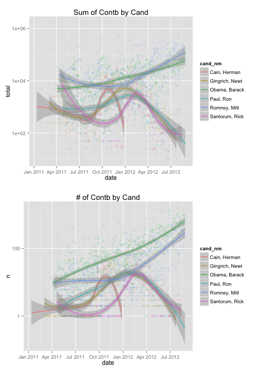
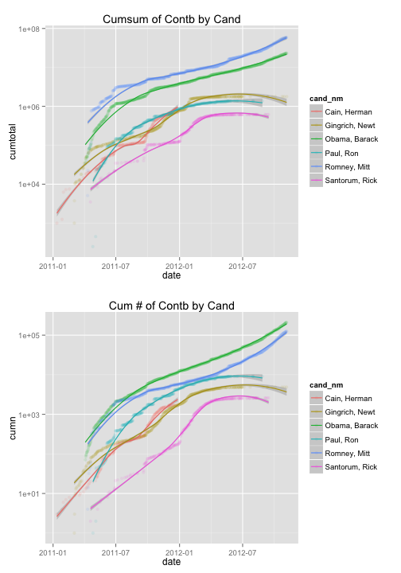

# Florida 2012 US Presidential Campaign Contribution Analysis 

by Frank Corrigan

========================================================

## Introduction

This is an exploration of 2012 US presidential campaign donations in the state of Florida. Over the past few decades, Florida has been the most populated of the "swing states" -- states where both political parties (republican/democrat) have a similar level of support. The dataset comes from the [Federal Election Committee](http://www.fec.gov/disclosurep/PDownload.do). [In 1975, the US Congress created the Federal Election Commission (FEC) to administer and enforce the Federal Election Campaign Act (FECA) - the statute that governs the financing of federal elections... and oversees the public funding of Presidential elections.](http://www.fec.gov/about.shtml). Noting a strong correlation between [campaign spending and election results](http://www.thewire.com/politics/2013/11/does-more-campaign-money-actually-buy-more-votes-investigation/71473/) and having perfect hindsight of knowing how the 2012 Presidential election results, analyzing this dataset can put the answers to a lot of questions (below) into context.

In Florida, which candidates received the most dollars and from how many people? Where do these contributors reside? What do they do? When do they donate? Are there distinct characteristics in the data between Republican contributors, Democratic contributors.. and other party contributors? If so, given these characteristics, can we predict which political party an individual/entity will contribute to? Is the total campaign donation as important as count of contributors and/or amount per contributor? Do more people contribute earlier or later in the campaign cycle and when do they do it? ([this gets hairy since donation day not necessarily equal to donation processed day](http://www.mattblackwell.org/files/papers/gamechangers.pdf))? Is contribution size (large vs. small) important?

Lots of questions, lets look for some answers...

Begin with loading the dataset and the crucial packages -- dplyr, ggplot2, ggthemes, and gridExtra.


## Univariate Analysis


```
## 'data.frame':	361634 obs. of  18 variables:
##  $ cmte_id          : chr  "C00495820" "C00495820" "C00495820" "C00495820" ...
##  $ cand_id          : Factor w/ 14 levels "P00003608","P20002523",..: 12 12 12 12 12 13 13 13 13 13 ...
##  $ cand_nm          : Factor w/ 14 levels "Bachmann, Michele",..: 8 8 8 8 8 7 7 7 7 7 ...
##  $ contbr_nm        : Factor w/ 82175 levels "& KOHN, P.A., GOUDIE",..: 9674 17733 65674 41698 67784 49678 37315 55553 15785 55269 ...
##  $ contbr_city      : Factor w/ 1396 levels "_MIAMI","???????? MIAMI",..: 187 722 426 724 431 722 500 341 921 1281 ...
##  $ contbr_st        : Factor w/ 1 level "FL": 1 1 1 1 1 1 1 1 1 1 ...
##  $ contbr_zip       : Factor w/ 51231 levels "","00000","00023",..: 15203 23557 8847 21273 36514 19684 15411 39700 2907 34831 ...
##  $ contbr_employer  : Factor w/ 28948 levels "","---","(SELF) DIGITAL SOLUTIONS  INTEGRATION",..: 27976 22790 18168 14109 22705 21281 18315 14446 4736 21281 ...
##  $ contbr_occupation: Factor w/ 12643 levels ""," CAPITAL",..: 1592 12569 9610 201 8074 9610 9610 9571 1294 9610 ...
##  $ contb_receipt_amt: num  20 100 50 50 500 100 10 50 100 25 ...
##  $ contb_receipt_dt : Factor w/ 653 levels "01-APR-12","01-AUG-11",..: 110 110 110 110 110 494 242 297 618 491 ...
##  $ receipt_desc     : Factor w/ 26 levels "","ATTRIBUTION TO PARTNERS REQUESTED / REDESIGNATION REQUESTED",..: 1 1 1 1 1 1 1 1 1 1 ...
##  $ memo_cd          : Factor w/ 2 levels "","X": 1 1 1 1 1 1 1 1 1 1 ...
##  $ memo_text        : Factor w/ 199 levels "","*","* EARMARKED CONTRIBUTION: SEE BELOW",..: 1 1 1 1 1 1 1 1 1 1 ...
##  $ form_tp          : Factor w/ 3 levels "SA17A","SA18",..: 1 1 1 1 1 1 1 1 1 1 ...
##  $ file_num         : int  779227 779227 779227 779227 779227 756218 756218 756218 756218 756218 ...
##  $ tran_id          : Factor w/ 306729 levels "0000026","0000140",..: 6312 6313 6314 6315 6316 15636 14567 16416 17275 16768 ...
##  $ election_tp      : Factor w/ 7 levels "","G2008","G2012",..: 7 7 7 7 7 7 7 7 7 7 ...
```

Initial observations. 361K contributions, 19 features -- mostly categorical, one numeric, one date (that's still factor and we'll convert to date object almost immediately). There is no party affiliation per se -- will need to add that. There is a lot of inconsistency in contributor city name and zip which will have to be cleaned to do any mapping. For instance, ST. AU7GUSTINE, ST. AUGUSTINE, ST. AUGUTINE, ST, AUGUSTINE. There are a lot of missing/invalid values in contrbutor employer and occupation. 

Immediately, we make the date usable and see that campaign contributions start 664 days (1.8 years)! before the election even takes place and are processed up to 55 days after. The mean date is July 30 and the median is Sept 16 which is a good indication that there are proportionally more contributions closer to the election.


```
##         Min.      1st Qu.       Median         Mean      3rd Qu. 
## "2011-01-12" "2012-06-29" "2012-09-16" "2012-07-30" "2012-10-17" 
##         Max. 
## "2012-12-31"
```

```
##    Min. 1st Qu.  Median    Mean 3rd Qu.    Max. 
##  -55.00   20.00   51.00   98.43  130.00  664.00
```

Similarly, a histogram can give us a sense of when contributions were received relative to the election. Binwidth set to 7 so each bar represents a week and the red line is the election date.

 

Who ran? A table shows us there are 14 candidates (2 with less than 50 contributions that get removed -- Jill Stein and Thaddeus McCotter) and the bar graphs show us that Barack Obama had the highest number of contributions both in total and even when we subset for the time period before Mitt Romney won the Republican nomination (which was on August 28, 2012).


```
## 
##              Bachmann, Michele                   Cain, Herman 
##                            699                           1720 
##                 Gingrich, Newt                  Huntsman, Jon 
##                           5041                            337 
##             Johnson, Gary Earl           McCotter, Thaddeus G 
##                            272                              1 
##                  Obama, Barack                      Paul, Ron 
##                         213335                           9123 
##              Pawlenty, Timothy                    Perry, Rick 
##                            258                            632 
## Roemer, Charles E. 'Buddy' III                   Romney, Mitt 
##                            305                         127251 
##                 Santorum, Rick                    Stein, Jill 
##                           2615                             45
```

 

Barak Obama wide leader in both instances. Maybe this is only because he is the incumbent and only Democratic candidate. What changes if we look at number of contributions per day in the race? What changes if we look at number of contributions per day in the race? As we can see below, not much at all. 


 

Mr. Obama still wide leader. So, let's group the by politcal party to better understand the contribution count distribution with another bar chart. Wow. Democrats had almost 1.5x as many donations as Republicans in FL in 2012. As background, Florida's electoral votes went Democrat in 2008 as well as 1996... but went Republican in 2000 and 2004. Moving on to contributor data.


```
## 
##          democrat libertarian/other        republican 
##            213335               577            147676
```

 

Moving on to the contributors themselves. For starters, how many contributions did the average individual/entity make and how many unique locations were contributors in? Using mean, length, and table functions we know that the average number of contributions was 4 (assuming different people aren't using the same name which is possible but not super important), there was 1,400 unique city names, and 51,000 unique zip codes.


```
## [1] 4.400219
```

```
## [1] 1396
```

```
## [1] 51231
```

Let's dive in and clean up those zip codes using the [zipcode](https://cran.r-project.org/web/packages/zipcode/zipcode.pdf) package. The clean zipcodes function still leaves us with many 9-digit zipcodes. For those we use the first 5 digits. This gives us a more manageable 1,468 zip codes (FL actually has 1,472 zip codes).


```
## [1] 1468
```

But we are not done, some of these zip codes are not even in Florida (FL zips all start with 3). So we remove those too and at the same time add latitude and longitude coordinates to our data based on these remaining zip codes. The head of our dataframe now looks as such... notice the last two columns of geographic coordinates.


```
##     cmte_id   cand_id       cand_nm           contbr_nm contbr_city
## 1 C00495820 P80000748     Paul, Ron       BURCH, NICOLE       COCOA
## 2 C00495820 P80000748     Paul, Ron DELAMO, CHRISTOPHER       MIAMI
## 3 C00495820 P80000748     Paul, Ron  SCHMIDT, ROBERT A. GULF BREEZE
## 4 C00495820 P80000748     Paul, Ron    LARA, CARIDAD A. MIAMI BEACH
## 5 C00495820 P80000748     Paul, Ron     SHUCK, RANDY A.    GULFPORT
## 6 C00431445 P80003338 Obama, Barack MICHAELS, ALEXANDER       MIAMI
##   contbr_st contbr_zip contbr_employer contbr_occupation contb_receipt_amt
## 1        FL  329272905         WALMART           CASHIER                20
## 2        FL      33173   SELF-EMPLOYED    WRITER / TUTOR               100
## 3        FL      32561            NONE           RETIRED                50
## 4        FL  331403830  KAUFMAN ROSSIN             ADMIN                50
## 5        FL  337073935            SELF         PHYSICIAN               500
## 6        FL  331252611         RETIRED           RETIRED               100
##   contb_receipt_dt receipt_desc memo_cd memo_text form_tp file_num
## 1        06-DEC-11                                  SA17A   779227
## 2        06-DEC-11                                  SA17A   779227
## 3        06-DEC-11                                  SA17A   779227
## 4        06-DEC-11                                  SA17A   779227
## 5        06-DEC-11                                  SA17A   779227
## 6        24-AUG-11                                  SA17A   756218
##     tran_id election_tp       date days_from_elec      party   zip
## 1   0925619       P2012 2011-12-06            336 republican 32927
## 2   0925642       P2012 2011-12-06            336 republican 33173
## 3   0925666       P2012 2011-12-06            336 republican 32561
## 4   0925692       P2012 2011-12-06            336 republican 33140
## 5   0925697       P2012 2011-12-06            336 republican 33707
## 6 C11908298       P2012 2011-08-24            440   democrat 33125
##               city state latitude longitude
## 1            Cocoa    FL 28.47123 -80.79887
## 2            Miami    FL 25.70243 -80.36184
## 3      Gulf Breeze    FL 30.37547 -87.09013
## 4      Miami Beach    FL 25.81423 -80.13085
## 5 Saint Petersburg    FL 27.75651 -82.71764
## 6            Miami    FL 25.78218 -80.23607
```

Out of curiosity, I wanted to see if we could use a numeric lat/lon combo to find differences. However, this didn't yield the results I was looking for. However, it did reinforce my suspicion that Republican donations are larger generally than Deomcrat ones.


```
## Warning in scale$trans$trans(x): NaNs produced
```

```
## Error: Incompatible lengths for set aesthetics: fill, alpha
```

There are an absurd amount of occupations in our user data - 12,600 ([US BLS tracks 800 jobs across the US](http://www.bls.gov/bls/occupation.htm)). That's roughly 25 people per occupation per contribution. A quick look at the tail of the contributor's occupations and we see why. Many occupations are mispelled, mysterious, or na/missing. 


```
## [1] 12643
```

```
## 
##                             UNEMPLOYED 
##                                    287 
##                        BANK OF AMERICA 
##                                    294 
##          UNIVERSITY OF CENTRAL FLORIDA 
##                                    329 
##                              REQUESTED 
##                                    334 
##            FLORIDA ATLANTIC UNIVERSITY 
##                                    338 
##                                    IBM 
##                                    339 
##                      AMERICAN AIRLINES 
##                                    349 
##                              WALGREENS 
##                                    350 
##                                   USPS 
##                                    354 
##                        LOCKHEED MARTIN 
##                                    410 
##                                REFUSED 
##                                    438 
##                                STUDENT 
##                                    467 
##       FLORIDA INTERNATIONAL UNIVERSITY 
##                                    478 
##               FLORIDA STATE UNIVERSITY 
##                                    577 
##            UNIVERSITY OF SOUTH FLORIDA 
##                                    589 
##                               DISABLED 
##                                    599 
##                          SELF EMPLOYED 
##                                    896 
##                                    N/A 
##                                    997 
##                    UNIVERSITY OF MIAMI 
##                                   1042 
##                       STATE OF FLORIDA 
##                                   1179 
##                  UNIVERSITY OF FLORIDA 
##                                   1340 
##                                        
##                                   2761 
##                                   SELF 
##                                   3238 
##                              HOMEMAKER 
##                                   5728 
##                                   NONE 
##                                   8005 
##                  INFORMATION REQUESTED 
##                                   8550 
## INFORMATION REQUESTED PER BEST EFFORTS 
##                                  15752 
##                           NOT EMPLOYED 
##                                  23412 
##                          SELF-EMPLOYED 
##                                  33532 
##                                RETIRED 
##                                  98389
```

However, we also see that by far the largest contributors are retired folks. I won't worry about the inconsistency in occupation for now (RETIRED, RETIRED TEACHER, HAPPILY RETIRED, ETC.), but just note that it exists. Wishful thinking here was hoping to seperate 'young' versus 'old' using the occupation data grouping RETIRED into old and everyone else into young, however, the data comes out to be roughly 70young/30old where I thought it would be heavier weighted toward 'old'. This does make sense though when you realize that only 15% of the US population is over the age of 65... so 30% is relatively high.


```
##      
##        democrat libertarian/other republican
##   NO  0.7088396         0.6429840  0.6876546
##   YES 0.2911604         0.3570160  0.3123454
```

Moving on... contribution amount analysis will start with a summary.


```
##     Min.  1st Qu.   Median     Mean  3rd Qu.     Max. 
## -25000.0     25.0     52.0    234.2    200.0  25000.0
```

So the 25,000's look either like an error or maybe interparty transfer. Either way, I'm not going to view it as an outlier and drop it for now. At the same time, I am going to leave negative values out -- this is money either returned to contributor or transfered to another affiliation.


The overall distribution of amount is very right skewed (similar to the count of contributions) -- lots of small donations and some quite large one. I include a blue line as an indication of the individual contribution limit (2,600 in 2012). I use binwidth 100 since that, as we will see, is the mode contribution amount.

 

And if we do a binwidth of 1 things look similar...

 

And what are the most common contribution amounts? 100 is the mode... followed by 50, 250, and 25. All comfortable #'s.


```
## 
##    30    75     5   150    55    56    20   200    14    19  1000    15 
##  2928  3057  4144  4288  4330  4890  5892  8559  8996 10082 10363 12453 
##  2500   500    10    35    25   250    50   100 
## 14067 16281 16338 26279 29156 29554 39612 59656
```

When do these contributions happen -- a year before the election or the day before? Or somewhere inbetween? The vertical lines on the graph below represent the election day (red) and the day Mitt Romney became Republican nominee (blue). Above we looked at count by week, so now we'll use some black magic to look at amount by month and see that the money flows in 2-3 months before the election. 

 

What was learned during the univariate analysis? This dataset has 361K observations with candiadte & contributor features. Barack Obama and Mitt Romney received the most contributions, and Barack Obama had 1.5x the number of contributions than the republicans. The dates have a wide range -- from 664 days before election day to almost a month after. Retired folks are the top contributors (makes sense in Florida). Most contributions are 'small' and most (≈62%) contributions happen within 2 month of election day.

## Multivariate Analysis

Now the fun begins. Earlier, we saw that Barack Obama and Mitt Romney received the most contributions. Is that same for amount of money raised? We start with boxplots for contribution amounts for each candidate and party. We see lots of different patterns between candidates. Tim Pawlenty and Rick Perry have higher medians and greater interquartile spreads while Barack Obama might just have the lowest median. It is also evident that Mitt Romney has some very wealthy contributors. The distribution of Romney's and Obama's contributions are representative of their parties as seen in the second graph below.

  

For reference, who raised the most money in this election? Mitt Romney.


```
## Source: local data frame [12 x 2]
## 
##                           cand_nm       money
##                            (fctr)       (dbl)
## 1                    Romney, Mitt 58707269.69
## 2                   Obama, Barack 23228483.74
## 3                  Gingrich, Newt  1782258.49
## 4                       Paul, Ron  1364622.21
## 5                     Perry, Rick   882626.89
## 6                    Cain, Herman   690747.82
## 7                  Santorum, Rick   617066.62
## 8               Pawlenty, Timothy   361078.92
## 9                   Huntsman, Jon   290224.19
## 10              Bachmann, Michele   194248.00
## 11             Johnson, Gary Earl   123480.72
## 12 Roemer, Charles E. 'Buddy' III    17286.35
```

When we look at the parties boxplot, again, we see that Republicans received larger donations than Democrats (in this case that's just Barack Obama). Lets look at this information in a table. The results are amazing. Whereas Democrats had more contributions, we see hear that Republicans raised many more dollars. Having perfect hindsight of the 2012 election, this tells me that it's not necessarily about size of contributions but about the number of donations. Next time I see a headline saying "Candidate X raised $4,000,000" I'll know that relatively unimportant :)


```
## Source: local data frame [3 x 5]
## 
##               party    total      mean median      std
##               (chr)    (dbl)     (dbl)  (dbl)    (dbl)
## 1          democrat 10506358  80.92085     35 192.5336
## 2 libertarian/other    43260 569.21053    250 915.4107
## 3        republican 30090507 345.68513    100 634.5738
```

Ok. Knowing Barack Obama received many small donations.. I am going to delineate small from large at $200 and store that as a feature in the dataset. We see this interesting matrix where Democrats contributions were split 6%large/53%small of all contributions and Republicans we split 17%large/24%small of all contributions.


```
##                    
##                           Large       Small
##   democrat          0.063153940 0.527057564
##   libertarian/other 0.000493434 0.001076583
##   republican        0.169368405 0.238850075
```

Since this idea of small/large donations is fascinating to me, I want to do one more thing -- look at the distribution of by politcal party

 

Despite the in contribution size, if we scale the data using ggplots scale_y_log10() function we see that the Democrats and Republicans actually had similar contribution patterns.

We know Mitt Romney raised the most money out of the Republican candidates.. but was that always true. Let's dig deeper. To make things easier on the eyes, I filter out only participants I considered 'read' contenders -- this includes Cain, Gingrich, Obama, Paul, Romney, and Santorum. These graphs below are a bit noisy, but they capture the essence of calling the election a race... on the top Mitt Romney wins and on the bottom Barack Obama wins. This reinforces my notion that it's the # of contributions that really counts. 

 

Another way to look at this, maybe, is via cumulative contributions. And I'll subset the data to only contributions leading up to the election. The result? A beautiful graph. That's race data. It clearly shows the importance of contribution count.

 

Next: Locations. Where are contributors and can we identify clusters of contributors to a specific political party? All I need is a simple normalized bar chart showing the split between parties across zip codes. Lots of variation from zip to zip.

 

Variation is good for modeling, but as humans we need a map to get a sense of where these clusters live. Lots of blue (Democrat) in Miami, St. Petersburg/Tampa, and to a lesser extent Orlando and then red (Republican) spread out across the state. This makes sense.

 

And just a few more things before we start to model this. In total, we saw a lot of contributions coming in 2 months within the election, but what if we break this down by candidate? Here  plot the median contribution by day per candidate. Maybe not important, but interesting that median donation size typically falls as election nears -- that probably says something about who donates when. In these graphs, the red line indicates Romney's nomination date and blue the election date. We can see who left the race early (Bachmann, Cain, Perry).

 

To confirm the notion that number of contributions is more important than sum of them, lets look at the same graph as above but by contribution count over time. Ahh, two are not like the others...

 

As expected. 

What was learned during the mulitivariate analysis? Mitt Romney raised the most money in the 2016 US Presidential election and on averaged received larger contributions than Barack Obama (however across the board small contributions are the norm). We compared this to the count of contributions by each candiata. Each measure tells a different story fo the race. Maping contributors by zipcode we see bigger clusters of Democratic contributions in the Miami, St. Petersburg/Tampa, and Orlando areas. We'll use these lessons in an attempt to create a model that uses contributor characteristics to predict which political party that individual will contribute to.

## Modeling

In this section we create a logistic regression model in an attempt to use a contributor's characteristics (location, contribution amount, etc.) to predict which political party they are contributing to. 

We began by

* Filtering only Democrat and Republican contributions
* Splitting the data into training and testing sets
* And build a model that uses latitude, longitude (use abs of longitude because it's easier to conceptualize), contribution amount, over200? and an interaction term between latitude and longitude.

The model summary looks OK. All p-values are small (but given our dataset size of 300K, I would expect that and I'll only consider something significant if p < 0.01) and most coefficient estiamtes are small.


```
## 
## Call:
## glm(formula = as.factor(party) ~ latitude + abs(longitude) + 
##     contb_receipt_amt + over200, family = "binomial", data = training)
## 
## Deviance Residuals: 
##     Min       1Q   Median       3Q      Max  
## -3.0303  -0.8819  -0.7835   0.9996   1.6835  
## 
## Coefficients:
##                     Estimate Std. Error z value Pr(>|z|)    
## (Intercept)       -5.824e+00  2.634e-01  -22.11   <2e-16 ***
## latitude           9.586e-02  3.665e-03   26.16   <2e-16 ***
## abs(longitude)     4.420e-02  3.877e-03   11.40   <2e-16 ***
## contb_receipt_amt  7.526e-04  1.436e-05   52.42   <2e-16 ***
## over200Small      -1.278e+00  1.326e-02  -96.33   <2e-16 ***
## ---
## Signif. codes:  0 '***' 0.001 '**' 0.01 '*' 0.05 '.' 0.1 ' ' 1
## 
## (Dispersion parameter for binomial family taken to be 1)
## 
##     Null deviance: 361362  on 267092  degrees of freedom
## Residual deviance: 321601  on 267088  degrees of freedom
## AIC: 321611
## 
## Number of Fisher Scoring iterations: 4
```

In order to interpret these results, I start with the odds ratios for the coefficients.


```
##       (Intercept)          latitude    abs(longitude) contb_receipt_amt 
##       0.002956633       1.100609443       1.045189599       1.000752909 
##      over200Small 
##       0.278713317
```

The odds ratio tell us the following holding other contributions contant for each interpretation:
* Latitude: For a 1 unit increase in latitude (movement north), the odds of the contribution being Republican increases 10%.
* Longitude: For a 1 unit increase in longitude (movement west), the odds of the contribution being Republican increases by 4.5%.
* Contribution Amount: For a 1 unit in crease in contribution amount, the odds of the contribution being Republican increase by 0.07% (very very small, but remember the mode contirbution amount was $100).
* Over200: If the contribution amount is over $200, the odds of it being a Republican contribution rises 0.27%

The size of this dataset made me question this significance and the 'p-value problem'. [Read more here.](http://www.galitshmueli.com/system/files/Print%20Version.pdf) However, even when I use significance level of 0.01 all p-values fall way below. In order to test the model fit in general, we use a chisq test and find a p-value of 0.0.


```
## [1] 0
```

Second measure of fit. If we used our model to make predictions on our test set... how accurate would it be?


```
##                
## predicted_party democrat republican
##      democrat      47064      21350
##      republican     5589      15028
```

```
## [1] 0.30258
```

So, we end up with a 31% error rate in our predictions.

## Final Plots and Summary

In this section, we brush up the best looking and most informative plots we discovered above.

### Plot 1

This first plot reveals the importance of number of contributions over size of the contributions. In the top chart -- cumulative sum -- Mitt Romney's blue line is the leader. In the bottom chart -- cumulative count -- Barack Obama is the leader up to and on election day.

 

### Plot 2

Using ggmap we are able to see areas of high volume contribution giving. This includes Miami down south, St. Petersburg/Tampa to the west, Orlando in central FL, Jacksonville in the northeast, and to a lesser extent Pensicola and Tallahassee on the panhandle.


```
## Loading required package: ggmap
## Map from URL : http://maps.googleapis.com/maps/api/staticmap?center=27.685075,-83.111335&zoom=7&size=640x640&scale=2&maptype=roadmap&language=en-EN&sensor=false
```

 

### Plot 3

Although simple, this overlay histogram below is insightful. The orange clump to the left shows us that contribution size for Democrats is smaller, but taller, than the other parties contirbutions. Republicans are a bit higher and not as many as Democrats. And Liberatrian and Other contributors are fewer in number but they are true believers -- they contribute the biggest.

 


## Reflection

The state of Florida, every four years, is a definitive swing state in the US Presidential election. Since 1996 -- 5 election cycles ago -- the candidate that captured Florida's electoral votes became the next US President. This analysis identified several interesting characteristics about financial campaign contributors in this state. Whether you are a campaign manager trying to formulate a campaign strategy in Florida or a citizen wondering who to throw your support behind, there are several things to note. First, the number of contributions a candidate received is more important than the size of contributions. This means that voters might want to look at # of contributions candidates are receiving rather than listen to media reports of total dollar values candidates are receiving. Second, folks in cities tend to contribute to the Democrat party. Campaign managers should have a sense of where they want to spend their advertisting dollars and location tendencies will help. Third, senior citizens tend to be the largest contributors in Florida and lean slightly Republican. Again campaign managers take note (and I'm sure they do).

The ggplot2 and dplyr packages for r were indespensible for this project. Most code written included some function in one of these packages. A sincere thanks to the creators and maintainers of these packages is in order. 

Challenges and next steps. Due to the nature of the state's political lean, this data was difficult to model. I am still not convinced that there is a good way to identify whether a individual will contribute right or left. However, I believe the high level lessons from the data contribute to some form of understanding. We did see some consistency in contribution size and location across contributions. However, the next step is to explore this data A) across states in 2012 and B) across time in older elections. Two final ideas. First, there is an abundance of poll data that exists and it would be a wise (although probably time-consuming effort) to add this poll data to contribution data in order to find significant relationships. Second, it would be good to build a time series model to forecast # of contributions in 2012 and then apply it to the 2016 election data to date.

Happy to update report at request.
